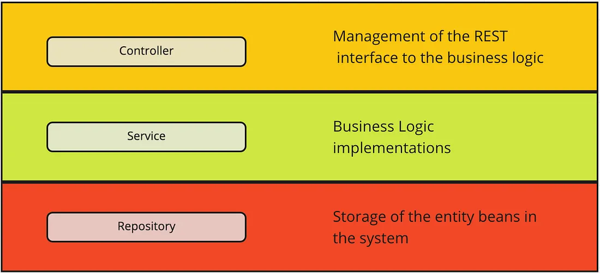

# turbo


## what is this? 
This is a template spring-boot microservice capable of, in a standardized manner: 

* talking to other services in a standardized manner by way of both HTTP and Kafka 
* responding to callers in a standardized manner by way of both HTTP and Kafka 
* handling errors and responding to the caller that made the request that resulted in error by way of standard response object 
* talking to postgres 
* reporting OpenAPI spec for every resource exposed by the service
* rendering OpenAPI spec for every resource exposed by the serivce 
* reporting resource signatures for every resource exposed by the service 
* automatic generation of docker container on build 
* standard logging facility 
* standard means of injecting transactionId (txid) and request time into all responses
* validation for request objects to ensure malformed requests/messages are strongly discouraged from being made
* standard CI/CD pipelineing for all services is possible given all services that are "turbo-charged" (instances of this template) all work exactly the same way. 
* enabling PatchFox engineers to crank out high-quality high-reliability new services and business logic at high-velocity 
* enabling PatchFox engineers to quickly understand the entire fleet of deployed assets because all deployed assets that are turbo-charged look and behave in exactly the same way. 


## why is this a thing? 
PatchFox Engineering operates on the **KSS** principle: 
* Keep it simple
* Simple is what scales
* Scale gets us paid

This project is how we do that. The intention is for PatchFox engineers to create new instances of this template service and inject whatever business logic is desired for that new service. All of the plumbing is automated to handle network comms, configuration, error handling, logging, reporting of onboard resources, etc. All the engineer need to is follow the established pattern to add or update new business logic. Moreover, when things go sideways or we have new engineers to onboard, everything looks the same so once an engineer groks the pattern they understand how every deployed asset in the fleet works. 


## how do I make it do stuff on my workstation? 
1. From project root, invoke `docker-compose up` (or `docker compose up` depending on what your OS and docker setup is.) This will start kafka, zookeeper, and postgres. 

2. In a new terminal, and from project root, invoke `mvn spring-boot:run`. This will build the project and spin up the service. 

## what endpoints are exposed by this service? 
* with the service up and running navigate your browser to `http://localhost:8080/swagger-ui/index.html` which will list the endpoints, what they do, and how to invoke them. 

## how do I make a new turbo-charged PatchFox service? 

1. create a new repository and copy the "turbo" source into it. 
2. change the name of the serivce in the [application.yml](https://gitlab.com/patchfox2/turbo/-/blob/main/src/main/resources/application.properties?ref_type=heads#L16) file to whatever you called the new serivce. All identifiers for the service are based on this config value so it's important you remember to change it before you do anything else! 
3. use your IDE to "refactor" the name of folder `src/main/java/io/patchfox/turbo` to `src/main/java/io/patchfox/{NAME OF SERVICE}`. LET THE IDE DO THIS BECAUSE THE IDE WILL ALSO UPDATE ALL THE PACKAGE NAMES.
4. in the `pom.xml` file make the following changes 
  ```
  	<groupId>io.patchfox.turbo</groupId>
	<artifactId>turbo</artifactId>
	<version>0.0.1-SNAPSHOT</version>
	<name>turbo</name>
	<description>PUT-DESCRIPTION-HERE</description>
  ```

  to

  ```
  	<groupId>io.patchfox.{NAME OF SERVICE}</groupId>
	<artifactId>{NAME OF SERVICE}</artifactId>
	<version>0.0.1-SNAPSHOT</version>
	<name>{NAME OF SERVICE}</name>
	<description>{PUT-DESCRIPTION-HERE}</description>
  ```

5. change the names of the `properties` argument in [KafkaBeans.listenTo{Request|Response}Topic](https://gitlab.com/patchfox2/turbo/-/blob/main/src/main/java/io/patchfox/spring_boot_template/kafka/KafkaBeans.java?ref_type=heads#L84) 

from: 

```
{"spring.json.value.default.type=io.patchfox.package_utils.json.ApiRequest"}
```
and
```
{"spring.json.value.default.type=io.patchfox.package_utils.json.ApiResponse"}
```

to:

```
{"spring.json.value.default.type=io.patchfox.{NAME OF SERIVCE}.json.ApiRequest"}
```
```
{"spring.json.value.default.type=io.patchfox.{NAME OF SERVICE}.json.ApiResponse"}
```

respectively. 

## how does it work? 
All turbo-charged services follow the controller/service pattern. Moreover, all turbo-charged services use RESTful semantics for describing and manipulating resources. 



The "controller" is there to catch the request, validate arguments, and forward valid requests to the "service". 

The "service" is where the business logic lives. If processes the request and responds with an `ApiResponse` object which gets sent back to the caller by way of the network interface from which the request came. If the request was RESTful, so is the response. If the request was from Kafka, the response goes onto the Kafka topic specified in the ApiRequest object as the correct topic on which to put the response. 

For example

If a caller makes a REST request to `/api/v1/ping` then [HealthCheckController](https://gitlab.com/patchfox2/turbo/-/blob/main/src/main/java/io/patchfox/spring_boot_template/controllers/HealthCheckController.java?ref_type=heads#L18) catches the request. Note that arguments `txid` and `requestReceivedAt` are injected into the request by way of [RequestEnrichmentInterceptor](https://gitlab.com/patchfox2/turbo/-/blob/main/src/main/java/io/patchfox/spring_boot_template/interceptors/RequestEnrichmentInterceptor.java?ref_type=heads#L26). The caller doesn't specify that, the service handles that before the controller sees the request. 

The controller will call the service layer to process the request. In this case its a call to [HealthCheckService.getHealthCheckResponse(...)](https://gitlab.com/patchfox2/turbo/-/blob/main/src/main/java/io/patchfox/spring_boot_template/services/HealthCheckService.java?ref_type=heads#L21). An ApiResponse object is created and returned to caller. 


If you wanted to make the same request by through a Kafka message the process is very similar. An example can be found in the main [App class](https://gitlab.com/patchfox2/turbo/-/blob/main/src/main/java/io/patchfox/spring_boot_template/App.java?ref_type=heads#L41). You create an [ApiRequest](https://gitlab.com/patchfox2/turbo/-/blob/main/src/main/java/io/patchfox/spring_boot_template/json/ApiRequest.java?ref_type=heads#L28) object and send that message to the "request listener" topic for that service. All turbo-charged services have two topics they pay attention to, one for receiving requests and one for responding to requests. The `ApiReqeust` object contains the HTTP URI, verb, and response topic name (ie, which kafka topic the receiver of this message should put the reply) baked in. All you need do then is use `KafkaBean` method [KafkaBean.makeRequest(...)](https://gitlab.com/patchfox2/turbo/-/blob/main/src/main/java/io/patchfox/spring_boot_template/kafka/KafkaBeans.java?ref_type=heads#L130) method to submit the message. In the case of the example, the message is routed back to the same service and printed to the system log. 

Lastly if you wanted to make a RESTful request from the service, the process is exactly the same, except you invoke [RestHelper.makeApiRequest(...)](https://gitlab.com/patchfox2/turbo/-/blob/main/src/main/java/io/patchfox/spring_boot_template/helpers/RestHelper.java?ref_type=heads#L47) instead. See the main [App](https://gitlab.com/patchfox2/turbo/-/blob/main/src/main/java/io/patchfox/spring_boot_template/App.java?ref_type=heads#L62) class for an example. 


## how to I create new business logic? 

1. create the REST controller. Note that the "_SIGNATURE" constant is for Kafka to identify which REST controller to invoke upon receipt of request and MUST be accurate. 

2. create the service logic to backend the controller. 

3. go to the bottom of [KafkaBean.invokeMethod(...)](https://gitlab.com/patchfox2/turbo/-/blob/main/src/main/java/io/patchfox/spring_boot_template/kafka/KafkaBeans.java?ref_type=heads#L179) and add a "case" to the switch/case block with the correct arguments for the controller method associated with that HTTP signature. Note that everything else is handled for you by dark java reflection magicks. All you, the developer, need to is follow the mattern and invoke the "beanMethod" - which is guaranteed to be the controller method appropriate for the supplied HTTP signature, with the correct arguments. It's just that simple. 

## where are the patchfox json entities located for common payloads? 
see project [package-utils](https://gitlab.com/patchfox2/package-utils). It has all the goodies you seek. 


## what's missing? 
1. Testing. That will come after beta. It will be a bog standard JUnit5/Mockito setup. 
2. in future a lot of the manual steps taken to create a new instance of a turbo-charged service will be handled automatically by a maven plugin invocation. 
